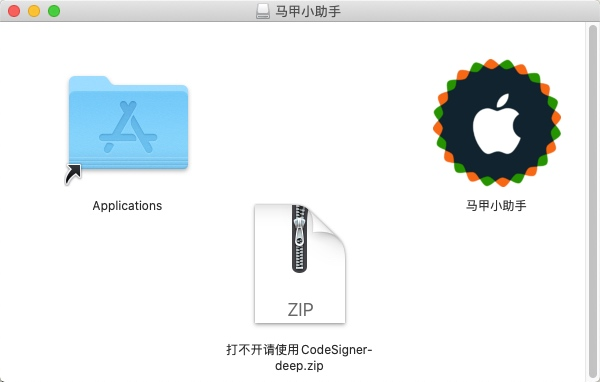
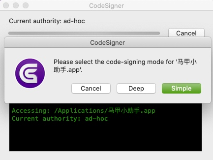

# 马甲小助手是什么?
马甲小助手是一个基于原生Mac OS原生开发,为开发者提供方便制作和(TODO)分析马甲包的工具.

# 如何收费?
1. 一般轻度混淆使用预览版即可,不限制使用次数.默认混淆30%代码,70%代码随机生成前后缀字母.加入QQ群417349932,可免费提供天数不等兑换码.你也可以凭推广截图可免费提供可观的使用天数(根据推广的程度7~30天不等).
2. 付费用户,可解锁全部功能.
3. 私聊群主PY交易可获得更多使用天数.

# 使用请必看
1. 本工具不会收集和上传任何的代码信息
2. 对于使用本工具混淆的工程不负担任何风险和责任
3. 混淆之后可能会出现少数的报错,需要人工修改
4. 对于充值的金额,不作任何退款申请
5. 工具每次运行混淆都会进行网络验证,请保持网络畅通
6. 使用本工具前必须安装Xcode
7. 本工具暂时仅支持OC代码
8. 请务必备份源码!请务必备份源码!请务必备份源码!

## 无法打开或者打开就闪退
如果打开提示->马甲小助手.app 已损坏，打不开。您应该将它移到废纸篓 ” 或 “ 打不开 马甲小助手.app，因为它来自身份不明的开发者
1. 打开终端（Terminal.app）
2. 拷贝粘贴 sudo spctl --master-disable，按回车键
3. 输入你的账户密码，按回车键确认执行（该密码不会显示，直接输入即可）

## 如已经开启任何来源，但依旧打不开（macOS Catalina 10.15以上会遇到）
1. 在系统的“安全与隐私”中允许“任何来源”，再打开终端
2. 输入以下命令，回车(注意路径根据自己的实际情况替换)
`sudo xattr -d com.apple.quarantine /Applications/马甲小助手.app`
1. 重启App即可.

## 如用上述方法仍然无法打开（macOS Catalina 10.15以上会遇到）
1. 打开马甲小助手dmg文件,先把马甲小助手移动到Applications

2. 解压CodeSigner到任意目录,打开CodeSigner,在弹出框选择马甲小助手,选择Deep,等待完成之后,即可打开APP

# 对比市面上的常见的混淆工具
* 市面上目前的混淆工具
    * 大部分基于Python的查找替换,效率低而且出错率高,复杂一点的项目完全没法用
    * 需要过滤绝大部分的第三方库,混淆不彻底
    * 没有考虑系统关键字和大部分系统方法,容易出错
    * 没有图形化界面或用户体验太差
* 马甲小助手
    * 抛弃原有市面上的常规做法,使用高效匹配,效率高出错率低,兼容各种大型工程
    * 无需过滤第三方库
    * 自动扫描工程依赖的系统库,过滤更加彻底
    * 专门为MacOS优化的图形界面

# 目前主要功能
* 快速便捷,操作简单
  * 提供项目的.app文件
  * 提供项目的根目录路径
* 自动忽略系统方法.系统变量,pods文件夹
* 混淆率更高,混淆后编译bug更少
  * 自动分析可混淆的符号(第三方库不在pods文件夹时也参与混淆)
  * 修改方法名时支持换行方法,嵌套方法等修改
  * 精准替换(效果类似xcode的refactor-rename)
* 支持多种模式,快速模式和自定义模式

# 使用步骤
 1. 拖入.app文件`请自行编译对应的APP文件`(注意.app路径不能带特殊字符串,如空格,中文,符号等等)
 2. 拖入工程根目录
 3. 在左侧选项卡中,选择你需要得功能.当然你也可以直接在首页选择快速配置进行混淆

# 黑名单配置
1. 直接根据界面上描述设置即可

# TODO LIST
- [x] 修改类名
- [x] 修改方法名
- [x] 修改变量
- [x] 修改文件夹
- [x] 支持xib、storyboard
- [x] 黑名单(文件夹,类名,方法名,变量)
- [ ] 修改资源
- [ ] 添加混淆资源(辣鸡代码)
- [ ] 加密字符串
- [x] 清除注释,修改文件注释(虽然注释并不参与编译)
- [x] 高可用性命名
- [ ] Swift兼容
- [ ] 工具选项卡开发

# 效果对比图

